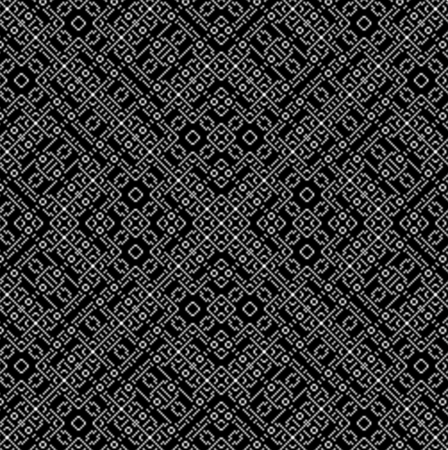

# `flure`

[WIP] a small stack-based language for creating procedural binary graphic (1-bit). run in [FORTH](https://www.forth.com/forth/)-like interpreter, written in [lua](https://www.lua.org/).

## prerequisites
- install lua packages by `sh ./requirements_install.sh`, makesure [`luarocks`](https://luarocks.org/) is already installed. 

## run
- `lua main.lua` for REPL mode
- `lua main.lua --build <OPTIONAL_FILE_NAME>`, output 1-bit graphic image

## example codes
- `x y ^ 5 % !` will compute an image as [`.pbm`](https://oceancolor.gsfc.nasa.gov/staff/norman/seawifs_image_cookbook/faux_shuttle/pbm.html) file. the procedurals are
  - start from `x` xor `y` 
  - then modulo by `5` 
  - and convert to `1` or `0` by `!` 
  - the process will be compute in matrix's manner
  - 

click to show the result image ( based-on <a href="https://twitter.com/aemkei/status/1378106731386040322">Martin Kleppe's post</a>)

## usages
- `flure` use reverse polish notation ([RPN](https://mathworld.wolfram.com/ReversePolishNotation.html)) eg `10 10 +` = `20`
- `x` and `y` coordinates: to be documented soon...
- support basic arithmatics `+`, `-`, `*`, `/`
- support function declaration (or `word` in FORTH's term) `: <function_name> <...args> ;` eg. `: loop 1 - dup 0 = if else loop then ;`
- compile mode = `:`, terminate compile mode = `;`
- support basic control flow `<condition> if <if_case> else <else_case> then ;`
- to exit = `bye`
- show stack = `show`
- remove top stack (last item pushed to stack) = `pop`
- comments = `( <...any_comments_here> )`
- `immediate`ly call a function = eg. `: bob 20 20 + ; immediate`, will return `40` without calling `bob` function.
- basic ops (`-1` = `true`, `0` = `false`) [see example](./docs/example)
  - `= (equal)`
  - `<> (not_equal)`
  - `and`
  - `or`
  - `> (greater_than)`
  - `< (less_than)`
  - `dup (duplicate)`
  - `swap`
  - `2dup (double duplicates)`
  - `rot (rotate)`

## resources
- https://beza1e1.tuxen.de/articles/forth.html
- https://www.youtube.com/watch?v=gPk-e9vGSWU&list=PLGY0au-SczlkeccjBFsLIE_BKp_sRfEdb&ab_channel=CodeandCrux
- https://github.com/nornagon/jonesforth/blob/master/jonesforth.S